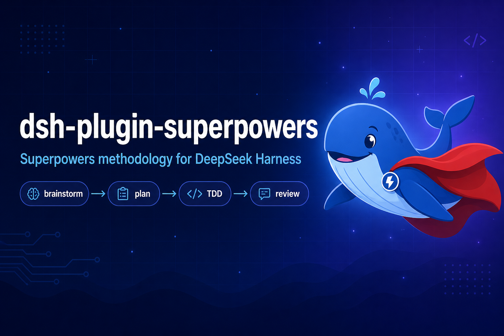

# dsh-plugin-superpowers



把 [Superpowers](https://github.com/obra/superpowers) 带到 [DeepSeek Harness](https://github.com/deepseek-ai/deepseek-harness)。

Superpowers 是一套给编码 Agent 用的软件开发方法论：不上来就写代码，而是先问清你到底要做什么，把它变成经你确认的设计，再拆成小到 2-5 分钟的任务清单，然后用红/绿 TDD 逐个实现、任务之间做代码审查。上游已适配 Claude Code、Codex、Cursor、Gemini CLI、Kimi Code、OpenCode、Pi、Hermes 等，本插件是 DeepSeek Harness 版。

## 安装

```sh
dsh plugin --profile <名字> add dsh-plugin-superpowers
```

把 `<名字>` 换成 `web`、`headless` 或自定义 profile 名，装完后重启对应形态。

## 它做了什么

- **把 14 个 Superpowers 技能注册到 `ctx.skills`**，直接出现在技能目录里，用原生 `skill` 工具加载。不会往你的 `~/.dsh/skills` 里拷任何文件。
- **把 `using-superpowers` 引导注册为提示词段落**（`superpowers:bootstrap`，order 50）。因为它属于系统提示词而不是一次性消息，所以第一条请求就在，且**上下文压缩后依然存在**——不需要会话启动钩子。
- **附带一份 DeepSeek Harness 工具映射**。Superpowers 面向多个 harness 编写、用的是 Claude Code 的大驼峰工具名；映射告诉模型 `Task` 就是 `subagent`、`TodoWrite` 就是 `todo_write`、`Bash`/`Read`/`Write`/`Edit` 对应小写工具，以及这里没有 hooks 和斜杠命令。

## 验证

新开会话提一个功能需求。装好之后 Agent 会先探查、再带着问题或设计回来，而不是直接开写；工具调用里能看到 `skill`。

想直接看配置是否挂上：

```sh
dsh --profile <名字> --dump-config
```

输出中应能看到 `id: superpowers`，下一行是 `name: dsh-plugin-superpowers`。

## 配置

所有字段可选，在 profile 自己的 `cordis.patch.yml` 里覆盖：

```yaml
- id: superpowers
  config:
    bootstrap: false
```

| 字段 | 默认 | 含义 |
|---|---|---|
| `skills` | `true` | 是否把内置技能注册到 `ctx.skills`。 |
| `bootstrap` | `true` | 是否注册 `using-superpowers` 提示词段落。 |
| `toolMapping` | `true` | 是否在该段落追加 DeepSeek Harness 工具映射。 |
| `order` | `50` | 引导段落的顺序：在 persona（0）之后、工具指导（100–199）之前。 |

关掉 `bootstrap` 后技能仍可被发现，但不再自动触发——模型只在自己想查目录时才用。

## 开销

引导段落给每次请求的系统提示词增加约 1.1k token（4,465 字符）。它是静态的，落在缓存前缀里，不会像消息那样每轮重发。不想要这份固定开销就设 `bootstrap: false`。

## 环境要求

DeepSeek Harness `0.1.0-rc.6` 及以上，Node 22.19+/24+。插件**零运行时依赖**，只通过 `ctx` 访问提示词与技能注册表。

## 上游

`skills/` 原样取自 [obra/superpowers](https://github.com/obra/superpowers) v6.3.0（`b36e082`），未做修改；`package.json` 的 `superpowers` 字段记录了确切版本与 commit。技能内容与方法论归上游所有——技能行为问题请提到上游，打包问题提到本仓库。

`brainstorming` 的可选视觉组件会从上游网站加载带 Superpowers 版本号的 logo（不包含项目或提示词内容）；设置 `SUPERPOWERS_DISABLE_TELEMETRY` 可关闭。

## 许可

MIT。适配器版权归其贡献者；`skills/` 下的内容版权归 Jesse Vincent 与 Superpowers 贡献者，依 [LICENSE.superpowers](LICENSE.superpowers) 的 MIT 许可分发。
